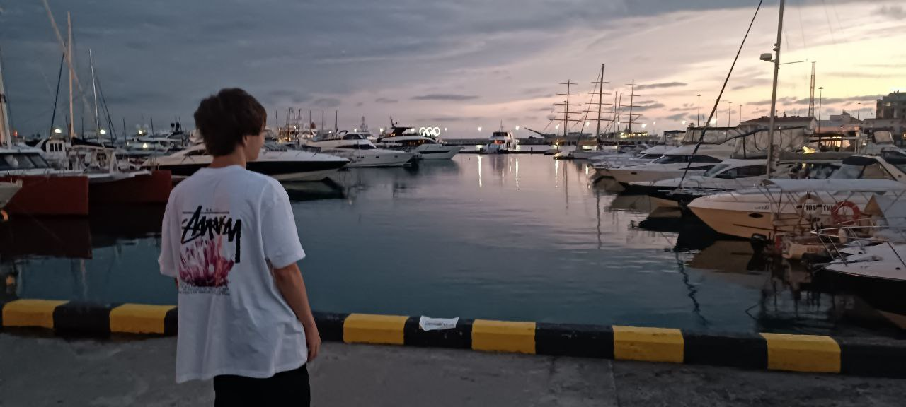

# Привет 👋, я Семён
 
💻 <b>Fullstack-разработчик</b> с более чем <b>7 годами опыта</b> в веб- и мобильной разработке.
🚀 Разрабатываю масштабируемые системы, проектирую архитектуру и внедряю микросервисные решения.
⚡ Опыт в создании мощного функционала от UI до высоконагруженного backend.

---

## 🚀 Стек технологий

### 🖥️ Frontend

### ⚙️ Backend

### 🗄️ Databases & Cache

### 🛠️ Infrastructure & Tools

---

## 🏢 Опыт работы

* 🔹 **Proslavlenie** — Middle разработчик (текущее место)
* 🔹 **Secrep** — Middle Fullstack
* 🔹 **Sobkred** — Middle Fullstack

👉 В проектах занимался:

* Проектированием **архитектуры систем**
* Разработкой и интеграцией **микросервисов**
* Оптимизацией производительности и внедрением CI/CD
* Созданием **сложного функционала** под высокие нагрузки

---

## 📊 GitHub Stats

---

## 🌐 Контакты

🌍 Сайт: [glushanenko.ru](https://glushanenko.ru)
💼 LinkedIn: [linkedin.com/in/glushanenko](https://www.linkedin.com/in/simon-glushanenko-8a08aa379)
✉️ Email: [416705cemen@gmail.com](mailto:semyon@glushanenko.ru)
💬 Telegram: [@riskiofi](https://t.me/riskiofi)

---

✨ Постоянно изучаю новые технологии и развиваю проекты с упором на **качество, скорость и масштабируемость**.
